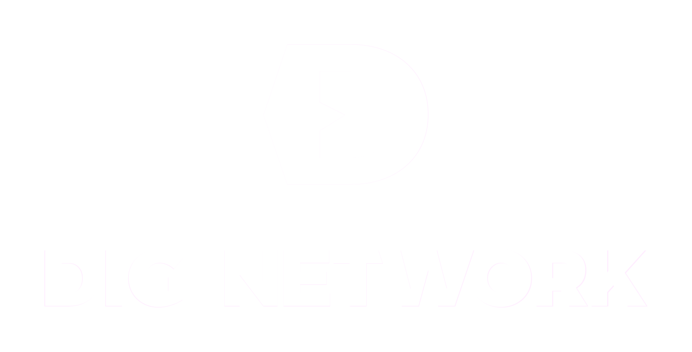

<p align="center">
  
</p>

<h1 align="center">digstore</h1>

<p align="center">
  <strong>A Git-shaped, encrypted, content-addressable store that compiles to a single self-defending WebAssembly module.</strong>
</p>

<p align="center">
  <a href="https://github.com/DIG-Network/digstore/actions/workflows/ci.yml"></a>
  <a href="https://github.com/DIG-Network/digstore/releases"></a>
  <a href="LICENSE"></a>
  
  
</p>

---

`digstore` gives you Git-style commands — `init`, `add`, `commit`, `log`, `clone`,
`push`, `pull` — for a store that is **encrypted at rest** and compiles into a
**single `.wasm` file**. That one file is both your data and the server that gates
access to it. A host that stores or relays it sees only ciphertext addressed by
hashes; it cannot read what it carries.

You address content with a URN, and the URN *is* the key: it both locates and
decrypts. Hand someone a URN and they can read that resource; without it they
can't, and there's no separate password or access list to manage.

Unlike Git, digstore is built for **build output**, not repo source — you point a
store at a directory like `dist/` and it captures what's there.

> New here? The full design is in the whitepaper:
> [`docs/whitepaper/digstore-whitepaper.pdf`](docs/whitepaper/digstore-whitepaper.pdf).

---

## Install

### Windows (installer)

1. Download `DigStore *-setup.exe` (or the `.msi`) from the
   [Releases](https://github.com/DIG-Network/digstore/releases) page.
2. Run it. It installs per-user (no admin prompt) and adds `digstore` to your
   `PATH`.
3. Open a **new** terminal and check it works:

   ```sh
   digstore --version
   ```

### Build from source (any platform)

You need [Rust](https://rustup.rs) (pinned to 1.94.1 via `rust-toolchain.toml`).
The CLI embeds a WebAssembly guest, so build that first:

```sh
rustup target add wasm32-unknown-unknown
cargo build -p digstore-guest --target wasm32-unknown-unknown --release
cargo build -p digstore-cli --release
```

The binary is at `target/release/digstore` (`digstore.exe` on Windows). Copy it
somewhere on your `PATH`.

---

## Quick start

```sh
mkdir my-project && cd my-project
digstore init                      # create a .dig workspace + a "default" store

echo "hello" > readme.txt
digstore add readme.txt --key readme
digstore commit -m "first generation"

digstore log                       # list generations (each root hash = a commit)
digstore urn readme.txt            # preview the URN a file will have — no guessing

# read a resource back (store id + root come from `digstore log --json`):
digstore cat urn:dig:chia:<storeID>:<rootHash>/readme
```

Commands discover the `.dig/` workspace by walking up from wherever you are (like
Git). `add`/`urn` operate on the store's **content root** (the current directory
by default; commonly a build dir — see below), and resource keys are always
relative to that root, so URNs are stable no matter which subdirectory you run
from.

---

## Multiple stores per project

A project can hold many stores ("capsules") in one `.dig/` workspace, each with
its own content, keys, and history.

```sh
digstore init site --dir dist      # a store named "site" that captures ./dist
digstore init docs --dir build/docs
digstore stores                    # list stores; * marks the active one + capacity
digstore use site                  # switch the active store

digstore --store site add -A       # stage everything under dist/ into "site"
digstore staged                    # what's staged + size + remaining headroom
digstore unstage                   # clear staging
digstore commit -m "v1"            # seal a generation; writes a local urns.json index
```

- **Store selection:** `--store <name>` > the active store (`use`) > the single
  store if there's only one.
- **Content root:** each store captures a build directory (default: the current
  dir; set with `--dir` at `init` or `digstore dir <path>`). `-C/--cwd <path>`
  overrides it for one command.
- **Per-store cap:** each store is capped at **128 MB** of staged content,
  enforced at `add` (and defensively at `commit`); remaining capacity is shown by
  `add`, `status`, `staged`, and `stores`.
- **URN manifest:** `commit` writes a local `urns.json` / `urns.txt` — the
  publisher's index of every shareable URN for that generation.

---

## How content is addressed: URNs

Every resource is named by a URN. The URN alone locates **and** decrypts it:

```
urn:dig:<chain>:<storeID>[:<rootHash>][/<resourceKey>]
```

| Part | Meaning |
|---|---|
| `<chain>` | Chain identifier, e.g. `chia` |
| `<storeID>` | Your 64-hex store id (required) |
| `<rootHash>` | Optional: pin a specific generation; omit for the current one |
| `<resourceKey>` | Optional: which resource (content-root-relative path) |

`digstore urn [PATHS]` previews the exact URN (and retrieval key) a file *will*
have against the active store — so you can check before you commit instead of
guessing.

---

## Public vs private stores

```sh
digstore init             # public:  anyone with the URN can read
digstore init --private   # private: URN locates, but reading also needs a secret salt
```

- **Public** — the URN is sufficient to decrypt.
- **Private** — decryption also requires a secret salt the publisher holds and
  shares out-of-band. Pass it with `--salt <hex>` on `cat`/`checkout`.

---

## Sharing over a remote

A remote is an HTTPS endpoint that stores and serves your `.wasm` module.

```sh
# publisher
digstore remote add origin https://example.com/stores/<storeID>
digstore push origin

# consumer (fresh directory)
digstore clone https://example.com/stores/<storeID>
digstore cat   urn:dig:chia:<storeID>:<rootHash>/readme
digstore pull  origin          # later: fetch the publisher's newer generation
```

`clone`/`pull` **verify** what they download before installing it: the module must
match the store id you asked for, and the served root must carry the publisher's
signature. A malicious or broken server cannot feed you fabricated content — the
command fails instead. Remotes must be `https://` (plain `http://` is allowed only
for `localhost`).

---

## On-chain anchoring (Chia mainnet)

Every store is **anchored on Chia mainnet**. `digstore init` mints an empty store
singleton on-chain, and the singleton's **launcher id becomes the store id**.
Every `digstore commit` then pushes the new generation's root to that singleton
with an on-chain update and **blocks until the update confirms** before finalizing
the generation locally.

> **This spends real XCH.** Anchoring is mandatory — there is no offline mode.
> `init` and `commit` will not proceed without an unlocked wallet seed and enough
> funds, and they block on mainnet confirmation. All broadcast and chain reads go
> through [coinset.org](https://coinset.org) over HTTPS (no peer node or TLS cert
> to run).

### 1. Set up a wallet seed

digstore keeps an encrypted BIP-39 seed in `~/.dig/seed.enc`.

```sh
digstore seed generate          # create a new mnemonic (shown once — back it up)
# or
digstore seed import            # import an existing mnemonic
digstore seed status            # is a seed present / unlocked?
digstore lock                   # clear the cached-unlock session
```

The seed is encrypted with a passphrase (Argon2id + AES-256-GCM). After unlock it
is cached for a configurable TTL; `DIGSTORE_PASSPHRASE` supplies the passphrase
non-interactively (for CI/scripts). Global settings live in `~/.dig/config.toml`
(`coinset_url`, `unlock_ttl`, `fee`).

### 2. Fund the wallet

Minting and updates cost a small mainnet fee, so the wallet derived from your seed
needs XCH. If it's short, `init`/`commit` fail with `insufficient funds` and print
the **receive address** to send XCH to:

```
insufficient funds: need <N> mojos, have <M>; fund xch1…
```

Send XCH to that address, wait for it to confirm, then retry.

### 3. Init mints, commit anchors

```sh
digstore init                   # mints the store singleton; store id = launcher id
                                # blocks until the mint confirms on mainnet

digstore add readme.txt --key readme
digstore commit -m "first generation"
                                # pushes the new root on-chain; blocks until
                                # confirmed, then finalizes the generation locally
```

Both commands take `--wait-timeout <secs>` (default `300`) for how long to wait on
confirmation. On a confirm-timeout the store is kept **pending** (and the local
generation is *not* finalized) — it is resumable, not lost.

### 4. Resume / inspect an anchor

```sh
digstore anchor                 # resume a pending anchor: confirm the chain coin
                                # and flip the store to confirmed (idempotent)
digstore anchor status          # read-only: show the store's anchor state
digstore anchor status --json   # machine-readable state
```

Per-store anchor state (network, store id / launcher, coin id, status, last root,
last tx id, confirmed height) is recorded in the store's `anchor.toml`.

The compiled `.dig` module also embeds the on-chain pointer (network, launcher/store id,
current coin id, confirmed height, and a coinset endpoint hint) directly in its data
section. `digstore anchor status` surfaces this alongside the local `anchor.toml` state
(use `--json` for machine-readable output); `digstore anchor inspect <module.dig>` dumps
the pointer from any module file without a local workspace. The embedded coinset URL is
a hint only — local config and flags always take precedence.

> Note: `clone`/`pull` verify the publisher's signature over the served head **and**
> verify that the served root equals the store's current on-chain singleton root —
> read from the chain via the launcher id embedded in the module. They **fail closed**
> on a mismatch or an unreachable chain, making the chain the authority for the current
> root. (A module with no embedded on-chain pointer falls back to the head-signature
> gate.) See [`SECURITY.md`](SECURITY.md).

---

## Command reference

| Command | What it does |
|---|---|
| `digstore init [name] [--dir <path>] [--private] [--wait-timeout <s>]` | Create a store (default name `default`); mints its singleton on mainnet (store id = launcher id); `--dir` sets its content root |
| `digstore stores` | List stores with active marker, root, content root, capacity |
| `digstore use <name>` | Set the active store |
| `digstore dir [<path>]` | Show or set the active store's content root |
| `digstore add <path…> [-A] [--key <name>]` | Stage files (`-A` = the whole content root) |
| `digstore staged` / `digstore unstage` | List the staging area / clear it |
| `digstore commit [-m <msg>] [--wait-timeout <s>]` | Seal a new generation, anchor its root on mainnet (blocks until confirmed), compile the module, write the URN manifest |
| `digstore status` | Show staged/modified/untracked + capacity |
| `digstore log [--limit N]` / `digstore diff <a> <b>` | List / compare generations |
| `digstore urn [PATHS…] [--root <hex>]` | Preview the URN(s) files will have |
| `digstore cat <urn> [--salt <hex>] [--verify-proof]` | Read a resource by URN |
| `digstore checkout <root> --out <dir> [--salt <hex>]` | Write a whole generation to a directory |
| `digstore remote add\|list\|remove …` | Manage remotes |
| `digstore clone <url>` / `push [remote]` / `pull [remote]` | Sync with a remote (verified) |
| `digstore anchor [--wait-timeout <s>]` | Resume a pending on-chain anchor (confirm the coin, flip to confirmed) |
| `digstore anchor status [--json]` | Show the active store's anchor state + embedded module chain pointer (read-only) |
| `digstore anchor inspect <module.dig> [--json]` | Dump the on-chain pointer embedded in any module file (read-only, no workspace needed) |
| `digstore seed generate\|import\|status` / `digstore lock` | Manage the encrypted wallet seed used for anchoring |

Global flags: `--store <name>` (target a specific store), `-C/--cwd <path>`
(operating directory for this command), `--dig-dir <path>` (workspace location),
`--json` (machine-readable), `--quiet`, `--verbose`, `--color <auto\|always\|never>`.

### Wallet seed

`digstore seed generate|import|status` and `digstore lock` manage the encrypted
BIP-39 wallet seed used for on-chain anchoring — see
[On-chain anchoring](#on-chain-anchoring-chia-mainnet) above for details.

---

## What this gives you

- **Encrypted at rest.** Content is encrypted with a key derived from its URN.
  There is no key stored anywhere to recover — lose the URN, lose the read.
- **Provider-blind hosting.** Whoever hosts your store holds only ciphertext keyed
  by hashes; they can't scan it or read requests.
- **Verified downloads.** `clone`/`pull` reject content that isn't the genuine,
  publisher-signed store.
- **Uniform, self-contained.** A store is a single `.wasm`, padded to a uniform
  size so its bytes reveal nothing about how much content it holds. Copy it to
  back it up; run it to serve it.

---

## Security

Security posture, the hardening applied, and known residual risks are documented
in [`SECURITY.md`](SECURITY.md). Please report vulnerabilities privately to the
maintainer rather than opening a public issue.

## Contributing

Build, test, and contribution guidelines are in
[`CONTRIBUTING.md`](CONTRIBUTING.md).

## License

Licensed under the [GNU General Public License v2.0](LICENSE) — the same license
as Git.
